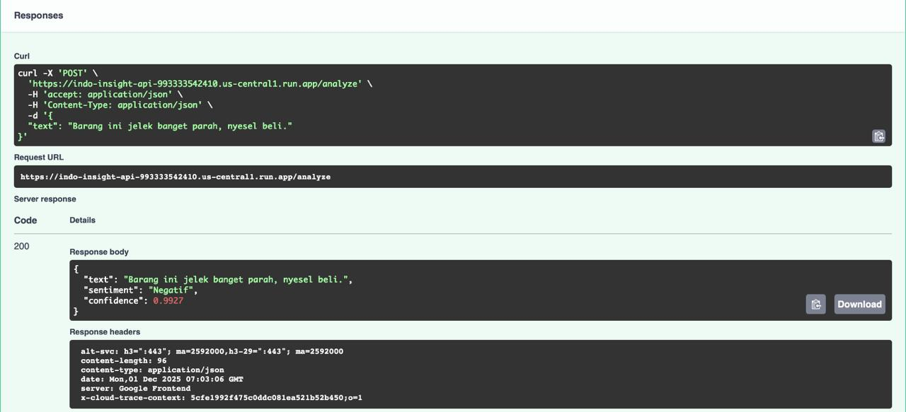
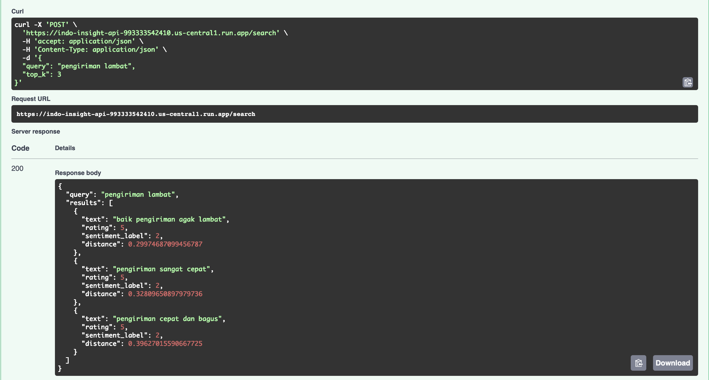
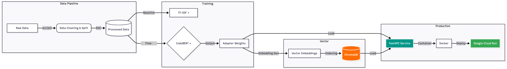

# IndoInsight: Scalable Sentiment & Semantic Search Engine


**IndoInsight** adalah sistem NLP End-to-End yang dirancang untuk menganalisis ulasan e-commerce Indonesia. Sistem ini tidak hanya mengklasifikasikan sentimen, tetapi juga memungkinkan **Pencarian Semantik (Semantic Search)** untuk menemukan ulasan berdasarkan konteks topik, bukan sekadar kata kunci.

**Live Demo API:** [KLIK DI SINI UNTUK MENCOBA (Swagger UI)](https://indo-insight-api-993333542410.us-central1.run.app/docs)

> **Catatan:** Server menggunakan strategi *Scale-to-Zero* untuk efisiensi biaya. Request pertama mungkin memakan waktu **20-30 detik** (Cold Start) untuk memuat model ke memori. Request selanjutnya akan < 1 detik.

## Demo Preview

| Sentiment Analysis | Semantic Search |
| :---: | :---: |
|  |  |
| *Mendeteksi sentimen negatif pada slang "parah"* | *Mencari "pengiriman lambat" menemukan "baik pengiriman agak lambat"* |

## Business Problem & Solution

### Masalah
Platform E-commerce menerima jutaan ulasan setiap hari. Metode filter tradisional (Bintang 1-5) atau pencarian keyword sering gagal menangkap nuansa:
1.  **Ambiguitas:** User memberi Bintang 5 tapi berkomentar sarkas *"Pengiriman lambat banget, tapi barang oke."* (Sentimen campuran).
2.  **Keterbatasan Pencarian:** CS sulit mencari *"Semua komplain logistik"* jika user menggunakan kata variatif (lelet, lama, nunggu mingguan) yang tidak cocok dengan keyword search biasa.

### Solusi IndoInsight
Sistem ini menggunakan **Fine-Tuned IndoBERT** dengan teknik **LoRA (Low-Rank Adaptation)** untuk efisiensi, digabungkan dengan **Vector Database (ChromaDB)**.

* **Sentiment Analysis:** Mendeteksi Negatif/Netral/Positif dengan pemahaman slang & konteks (F1-Macro: 0.65, Negative Recall: 0.76).
* **Semantic Search:** Mengubah teks menjadi vektor (embeddings) untuk pencarian berbasis makna (e.g., query *"barang hancur"* akan menemukan *"paket penyok"*).

## System Architecture



## Model Performance

Kami membandingkan pendekatan Deep Learning (IndoBERT) melawan Baseline Tradisional (TF-IDF + Logistic Regression).

| Metric | Baseline (TF-IDF) | IndoBERT (LoRA) | Improvement |
| :--- | :--- | :--- | :--- |
| **Accuracy** | 82.0% | **89.0%** | +7% |
| **Macro F1-Score** | 0.58 | **0.65** | +12% |
| **Negative Recall** | 0.55 | **0.76** | Signifikan |
| **Inference Speed** | ~0.5ms | ~100ms | Trade-off accepted |

> **Analisis:** Meskipun IndoBERT lebih lambat, ia memenangkan metrik bisnis terpenting: **Negative Recall (0.76)**. Model ini jauh lebih sensitif menangkap komplain pelanggan yang sering terlewat oleh model tradisional.

## Cara Menjalankan (Lokal)

Pastikan Anda memiliki Python 3.11+ dan Docker.

### 1. Clone & Install
```bash
git clone https://github.com/fikrifaizz/indo-insight.git

cd indo-insight

# Setup Virtual Env
python -m venv venv
source venv/bin/activate  # Windows: venv\Scripts\activate

# Install Dependencies (Optimized for Mac M-Series / Linux)
pip install -r requirements.txt

### 2. Setup Model & Data
Script ini akan mengunduh Model Base dan melakukan ETL data.
```bash
# Download IndoBERT Base ke folder local
python scripts/download_base.py

# Jalankan ETL Pipeline
python src/etl/extract.py
python src/etl/transform.py
python src/etl/load.py
``` 


### 3. Jalankan API Server
```bash
uvicorn src.api.main:app --reload
```
Akses Swagger UI di: ```http://localhost:8000/docs```

### 4. Menjalankan via Docker (Production Sim)
```bash
docker build -tindo-insight:v1 .
docker run -p 8080:8080indo-insight:v1
```

## 🔌 API Documentation

### 1. `/analyze` (POST)
Menganalisis sentimen teks input.

**Request:**
```json
{
  "text": "Barang bagus banget, pengiriman juga cepet!"
}
```
**Response:**
```json
{
  "text": "Barang bagus banget, pengiriman juga cepet!",
  "sentiment": "Positif",
  "confidence": 0.985
}
```
### 2. `/search` (POST)
Mencari ulasan serupa berdasarkan kesamaan makna (semantic similarity).

**Request:**
```json
{
  "query": "pengiriman lelet",
  "top_k": 3
}
```
**Response:**
```json
{
  "query": "pengiriman lelet",
  "results": [
    {
      "text": "baik pengiriman agak lambat",
      "rating": 5,
      "sentiment_label": 2,
      "distance": 0.29974687099456787
    },
    ...
  ]
}
```
## 👨‍💻 Author

**Fikri Faiz Zulfadhli**
*Machine Learning Engineer*

[](https://www.linkedin.com/in/fikri-faiz-zulfadhli/)
[](https://github.com/fikrifaizz)

---
*Project ini dikembangkan sebagai bagian dari portofolio End-to-End Machine Learning Engineering.*
